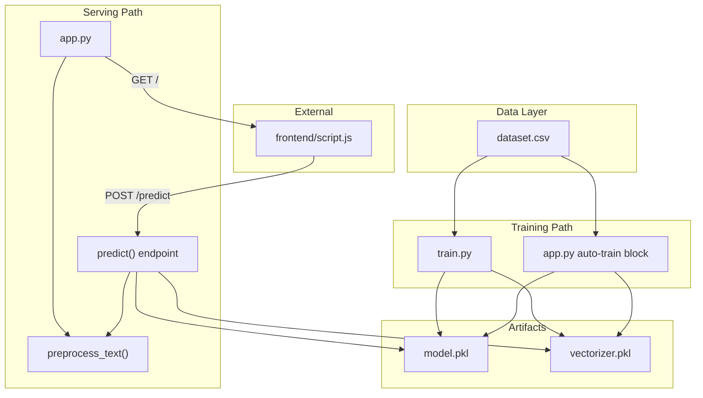
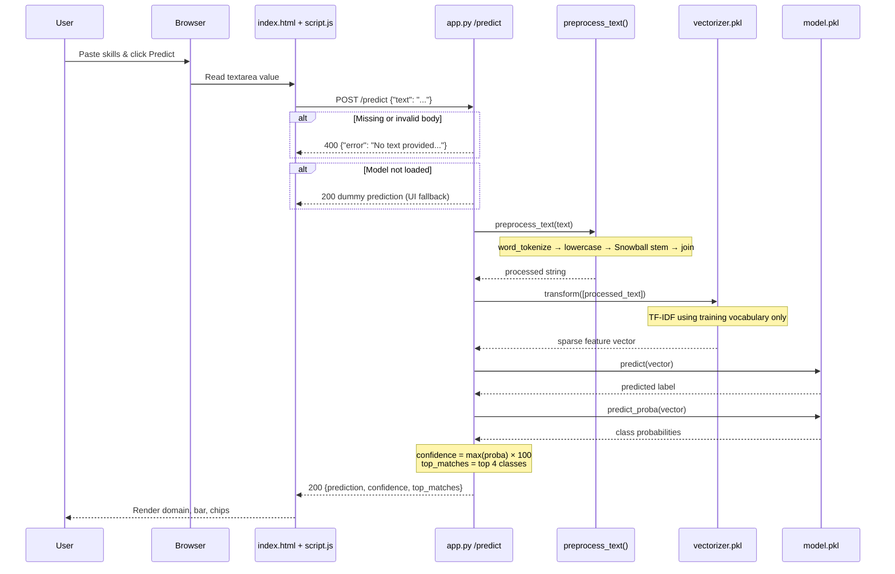

# Backend — Career Prediction Model

Flask ML service that trains a Naive Bayes text classifier on resume/skill text, serves predictions via `POST /predict`, and hosts the frontend from `../frontend/`.

**Stack:** Flask, scikit-learn, NLTK, pandas, joblib

---

## File Inventory

| File | Type | Primary Role |
|------|------|--------------|
| `app.py` | Runtime entry | Flask API, static frontend, auto-train, inference |
| `train.py` | Training script | Offline model training and export |
| `Notes.py` | Reference / Colab | Documented ML pipeline (Google Colab origin) |
| `dataset.csv` | Data | Labeled training data (`text`, `label`) |
| `requirements.txt` | Config | Python dependencies |
| `model.pkl` | Artifact (generated) | Trained `MultinomialNB` classifier |
| `vectorizer.pkl` | Artifact (generated) | Fitted `TfidfVectorizer` vocabulary |

---

## High-Level Architecture



---

## Workflows (Task → Files)

### Task A: First-time setup

| Step | File(s) | Action |
|------|---------|--------|
| 1 | `requirements.txt` | Install dependencies |
| 2 | — | `pip install -r requirements.txt` (run from `backend/`) |

### Task B: Manual model training

| Step | File(s) | What happens |
|------|---------|--------------|
| 1 | `dataset.csv` | Load labeled rows (`text`, `label`) |
| 2 | `train.py` | Run `python train.py` |
| 3 | NLTK (via `train.py`) | Download `punkt`, `punkt_tab` |
| 4 | `train.py` | Drop duplicates, preprocess, vectorize, train |
| 5 | `model.pkl`, `vectorizer.pkl` | Written to `backend/` |

**Files touched:** `train.py` → reads `dataset.csv` → writes `model.pkl`, `vectorizer.pkl`

### Task C: Start the server

| Step | File(s) | What happens |
|------|---------|--------------|
| 1 | `app.py` | Run `python app.py` (port **5000**, debug on) |
| 2 | `app.py` (auto-train block) | If artifacts missing → trains from `dataset.csv` |
| 3 | `app.py` | Load `model.pkl`, `vectorizer.pkl` |
| 4 | `app.py` | Serve `../frontend/index.html` at `/` |
| 5 | `app.py` | Expose `POST /predict` |

**Files touched:** `app.py` → reads/writes artifacts, reads `dataset.csv` (if auto-train), serves `../frontend/*`

### Task D: Handle a prediction request

| Step | File(s) | What happens |
|------|---------|--------------|
| 1 | `frontend/script.js` | `POST http://localhost:5000/predict` with `{ "text": "..." }` |
| 2 | `app.py` → `predict()` | Validate JSON, require `text` |
| 3 | `app.py` → `preprocess_text()` | Tokenize + Snowball stem |
| 4 | `vectorizer.pkl` | `transform()` (no refit) |
| 5 | `model.pkl` | `predict()` + `predict_proba()` |
| 6 | `app.py` → `predict()` | Return JSON response |

**Files touched at inference:** `app.py`, `model.pkl`, `vectorizer.pkl`

### Task E: Learn the ML pipeline

| File | Purpose |
|------|---------|
| `Notes.py` | Step-by-step Colab-style reference (Drive mount, preprocess, train, predict) |
| `train.py` | Local runnable version of that pipeline |
| `../frontend/documentation/career_prediction_system.ipynb` | Original notebook |

`Notes.py` is **not imported** by `app.py` or `train.py`; it documents the design.

---

## Single Prediction Request (Step-by-Step)



### Prediction flow (text)

```
User input (skills/resume text)
        │
        ▼
frontend/script.js  ──POST /predict──►  app.py → predict()
        │                                      │
        │                              validate JSON["text"]
        │                                      │
        │                              preprocess_text()
        │                              (tokenize + stem)
        │                                      │
        │                              vectorizer.pkl.transform()
        │                                      │
        │                              model.pkl.predict()
        │                              model.pkl.predict_proba()
        │                                      │
        ◄──────── JSON response ───────────────┘
   { prediction, confidence, top_matches }
```

---

## ML Pipeline

### Data (`dataset.csv`)

| Column | Description |
|--------|-------------|
| `text` | Comma-separated skills/keywords |
| `label` | Career category |

**Labels (8 categories):** Data Science, Web Development, DevOps, AI/ML, Backend Development, Android Development, Cybersecurity, Data Analytics

### Preprocessing (must match at train and predict time)

```
Raw text → word_tokenize() → lowercase → SnowballStemmer("english") → join tokens
```

Implemented in:
- `train.py` (preprocessing loop)
- `app.py` auto-train block
- `app.py` → `preprocess_text()`

### Feature extraction

```python
TfidfVectorizer(ngram_range=(1, 2))  # unigrams + bigrams
```

- **Training:** `fit_transform(processed_corpus)` → saved as `vectorizer.pkl`
- **Inference:** `transform([preprocessed_text])` only — never refit

### Model

```python
MultinomialNB().fit(X, labels)  → saved as model.pkl
```

### Inference output

| Field | Source |
|-------|--------|
| `prediction` | `model.predict(X)[0]` |
| `confidence` | `max(predict_proba) * 100` |
| `top_matches` | Top 4 classes by probability |

---

## API Reference

### `GET /`

| Item | Detail |
|------|--------|
| Handler | `home()` |
| Response | Serves `../frontend/index.html` |
| Static config | `static_folder='../frontend'` |

### `POST /predict`

| Item | Detail |
|------|--------|
| Handler | `predict()` |
| Body | `{ "text": "<skills or resume snippet>" }` |
| Success (200) | `{ "prediction": "...", "confidence": 94, "top_matches": ["...", ...] }` |
| Error (400) | Missing `text` |
| Error (500) | Processing failure |
| Fallback | If model not loaded: dummy response so UI still works |

---

## File-by-File Breakdown

### `app.py`

| Section | Responsibility |
|---------|----------------|
| Imports & Flask setup | Flask, CORS, static frontend |
| `GET /` route | Serve UI |
| NLTK stemmer init | Stemmer for preprocessing |
| Auto-train block | Train if `.pkl` files missing |
| Model load | Load artifacts at startup |
| `preprocess_text()` | Inference preprocessing |
| `POST /predict` | Prediction endpoint |
| `__main__` | Run on port 5000 |

### `train.py`

| Step | Action |
|------|--------|
| NLTK setup | Download tokenizers |
| Load data | Read CSV, dedupe |
| Preprocess | Tokenize + stem |
| Vectorize | TF-IDF fit |
| Train | Naive Bayes fit |
| Export | `joblib.dump()` both artifacts |

Use after changing `dataset.csv`, or before deployment without relying on auto-train.

### `Notes.py`

Colab reference script with the same pipeline (Google Drive paths). Not runnable locally without modification.

### `requirements.txt`

| Package | Used in |
|---------|---------|
| Flask | `app.py` — web server |
| flask-cors | `app.py` — CORS |
| joblib | `app.py`, `train.py` — serialize models |
| nltk | All scripts — tokenization/stemming |
| pandas | `app.py`, `train.py` — CSV loading |
| scikit-learn | `app.py`, `train.py` — TF-IDF + Naive Bayes |

---

## Task → File Matrix

| Task | Files involved |
|------|----------------|
| Install dependencies | `requirements.txt` |
| Prepare / update training data | `dataset.csv` |
| Train model manually | `train.py`, `dataset.csv` → `model.pkl`, `vectorizer.pkl` |
| Start server | `app.py`, (`model.pkl`, `vectorizer.pkl` or auto-train from `dataset.csv`) |
| Serve frontend | `app.py` → `../frontend/index.html`, `style.css`, `script.js` |
| Predict career from text | `app.py`, `model.pkl`, `vectorizer.pkl` |
| Learn pipeline logic | `Notes.py`, `train.py` |
| Retrain after data change | Edit `dataset.csv` → run `train.py` → restart `app.py` |

---

## Quick Start

### Development flow

```bash
cd backend
pip install -r requirements.txt
python train.py      # creates model.pkl, vectorizer.pkl
python app.py        # starts Flask on :5000
```

Open http://localhost:5000 and enter skills to predict.

### Quick start (auto-train)

```bash
cd backend
pip install -r requirements.txt
python app.py        # trains automatically if .pkl files are missing
```

---

## Important Constraints

1. **Preprocessing parity** — Inference must use the same tokenize + stem pipeline as training.
2. **Vectorizer vocabulary** — Use `transform()` at predict time, never `fit_transform()`.
3. **Working directory** — Run commands from `backend/` so `dataset.csv` and `.pkl` paths resolve.
4. **NLTK data** — First run downloads `punkt` and `punkt_tab`.
5. **Artifact location** — `model.pkl` and `vectorizer.pkl` live in `backend/` alongside `app.py`.

---

## Frontend Integration

| Backend | Frontend | Connection |
|---------|----------|------------|
| `app.py` | `index.html` | Served at `/` |
| `POST /predict` | `script.js` | `fetch('http://localhost:5000/predict', ...)` |
| CORS in `app.py` | Browser | Allows cross-origin requests |
