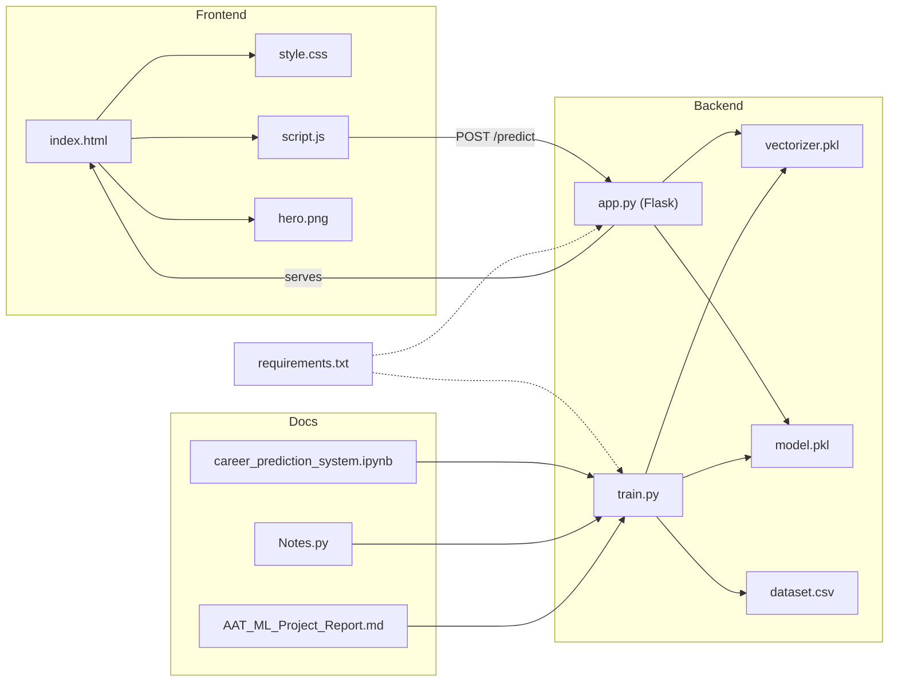
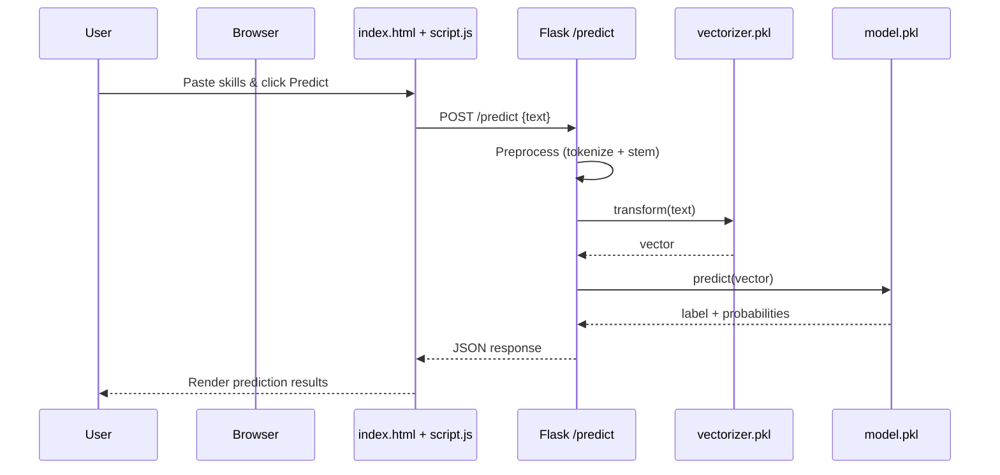

# Project Diagrams

## Dependency Graph (Mermaid)

## Sequence Diagram (Mermaid)

---

### How to View

- **VS Code**: Open `diagram.md` and use the Mermaid Preview extension.
- **GitHub**: Mermaid diagrams render automatically in Markdown files.
- **Online Editor**: Paste the Mermaid blocks into https://mermaid.live